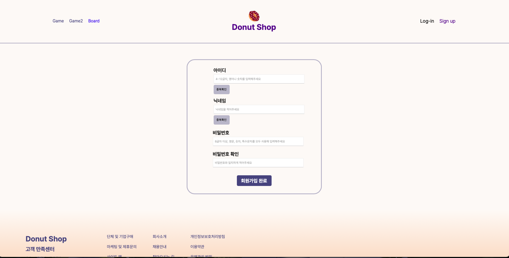
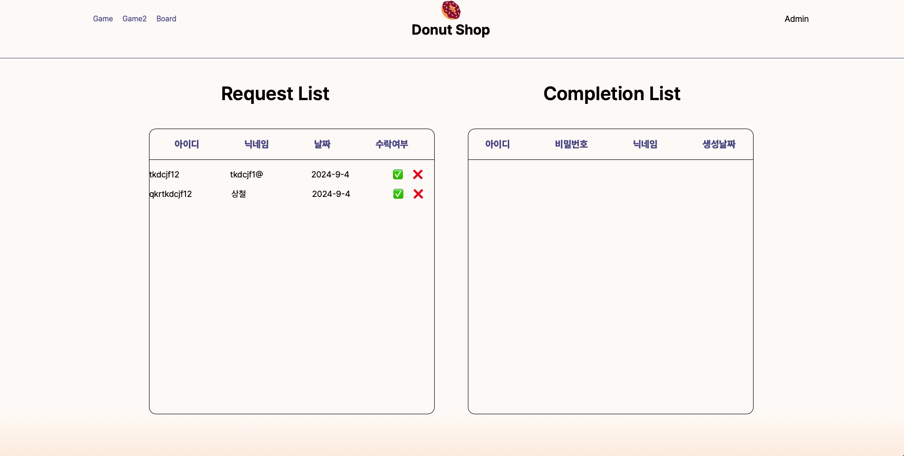
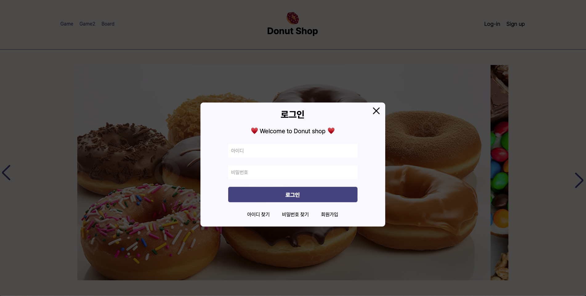
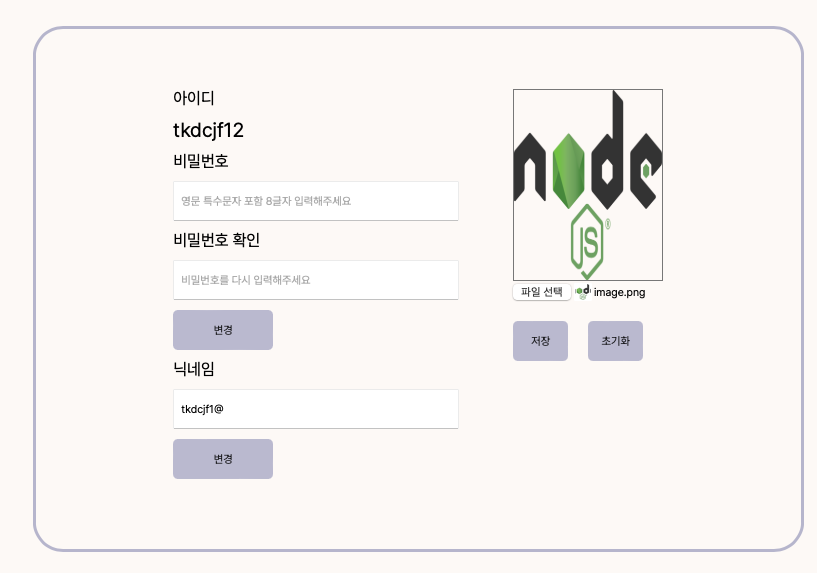

# Donut Shop 
- 도넛샵은 HTML, CSS, JS, TS 을 하드코딩하여 만든 도넛가게 홈페이지입니다.

## 개발자: 본인 외 3명

## 기간 : 2주

### 1. 주요 기능

1. 회원가입 / 관리자 계정
- 로컬스토리지로 관리자 계정과 호원 정보를 저장합니다.
- 관리자가 가입 승인을 허락하면 가입한 유저는 로그인을 할 수 있습니다.

2. 로그인
- 세션스토리지를 이용해 로그인 유지 기능을 구현

3. 마이페이지
- 프로필 사진 변경
- 닉네임 (중복확인), 패스워드 변경

4. 게시글 작성, 댓글 CRUD
- 로컬스토리지를 이용한 게시글 및 댓글 CRUD

본인 역할
- 페이지 구현
메인 페이지, 모달창을 이용한 로그인, 마이페이지 닉네임 & 프로필 사진 변경

- 메인 페이지
구상 : 슬라이드 배너 구현, 애니매이션, 

모달 로그인
- 로그인 모달창, 세션스토리지 로컬스티로지 

마이페이지
- 닉네임, 패스워드, 프로필 사진 변경

### 기술스택

